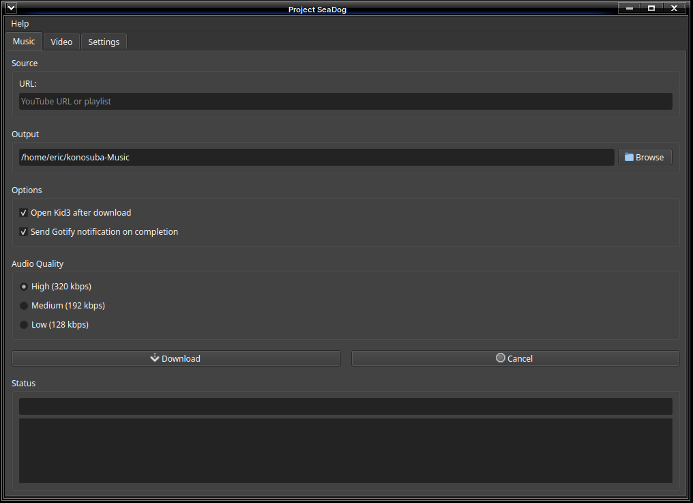
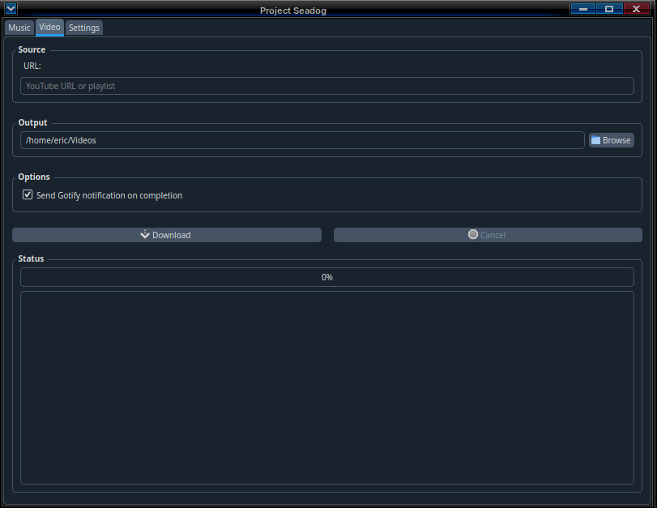
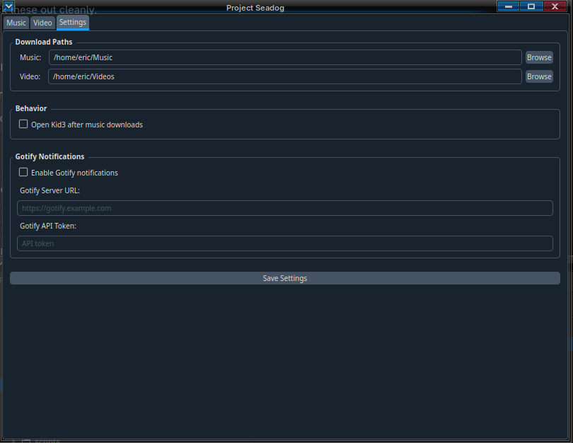

# Project Seadog

Seadog is a desktop GUI application for downloading music and videos  
from YouTube using yt-dlp.

## Features

- Music downloads (MP3)
- Video downloads
- Playlist support
- Configurable delay between playlist items
- Optional Kid3 integration
- Optional Gotify notifications
- Dark mode UI
- No terminal required

## Installation (Linux)

Download the latest binary from **GitHub Releases**.

### To run

```bash
chmod +x seadog-v1.0.0-linux-x86_64
./seadog-v1.0.0-linux-x86_64
```
## Upcoming Features

- Adjustable delay between playlist items to reduce rate-limiting risk
- YouTube and YouTube Music playlist monitoring
- Windows build
- Additional user-configurable UI options
- Display cover art / posters during downloads

## Screenshots

### Music Downloader


### Video Downloader


### Settings



### For Developers
```bash
python -m venv venv
source venv/bin/activate
pip install -r requirements.txt
python main.py
```


